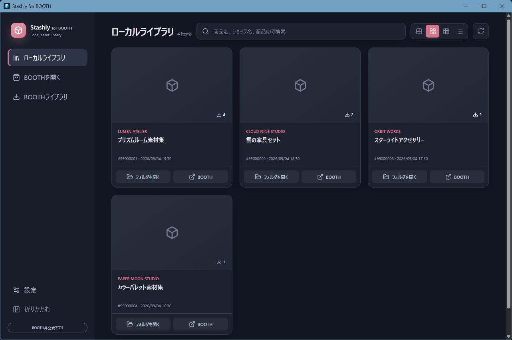

<p align="center">
  
</p>

BOOTHで購入したDL商品を、探しやすく、開きやすいローカルライブラリとして管理するWindows向けデスクトップアプリです。BOOTHから普段どおりダウンロードするだけで、商品ファイルをショップ・商品ごとのフォルダへ整理して保存します。



> [!IMPORTANT]
> Stashlyは個人が開発する非公式・実験的なオープンソースソフトウェアです。ピクシブ株式会社、BOOTH、pixiv、BOOTH Library Manager、各ショップオーナーとは提携・承認・協賛関係にありません。本アプリに関する問い合わせを公式サポートやショップオーナーへ送らないでください。

## Stashlyでできること

- BOOTHの購入済みライブラリをアプリ内で開き、そのまま商品をダウンロード
- ダウンロードしたファイルをショップ・商品・バリエーションごとのフォルダへ自動整理
- ZIPファイルを商品フォルダ内へ自動展開
- 商品名、ショップ名、BOOTH商品IDでローカルライブラリを検索
- サムネイルの大きさやリスト表示を切り替えて、商品を見やすく一覧表示
- ライブラリから保存フォルダやBOOTHの商品ページをすぐに開く
- 最大2ファイルを同時にダウンロードし、同じ商品の重複ダウンロードを防止
- Windowsの設定に連動するテーマ、ライトテーマ、ダークテーマとアクセントカラーを選択

ダウンロードした商品はStashly専用のライブラリで管理します。公式BOOTH Library Managerのデータベース、保存先、Windowsの`booth-library-manager://`設定を参照・変更することはありません。

## インストール

### 必要な環境

- Windows 10またはWindows 11（x64）
- Microsoft Edge WebView2 Runtime
- インストール時とBOOTH利用時のインターネット接続

### 手順

1. [GitHub Releases](https://github.com/00b7ce/Stashly/releases)から最新の`Stashly_*_x64-setup.exe`をダウンロードします。
2. ダウンロードしたインストーラを実行します。
3. アプリを起動し、表示される[プライバシーポリシー](PRIVACY.md)を確認して同意します。
4. 設定画面で商品の保存先を選びます。

> [!WARNING]
> 現在のWindowsインストーラにはAuthenticode署名がありません。そのため、Microsoft Defender SmartScreenの警告が表示されることがあります。Windowsの保護機能は無効にせず、配布元がこのリポジトリのGitHub Releasesであることを確認してください。

## 使い方

1. **保存先を決める** — 設定画面で、Stashly専用の保存先を選択します。公式BOOTH Library Managerの保存先とは分け、通常はPC内のローカルドライブを選んでください。
2. **BOOTHへログインする** — サイドバーの「BOOTHライブラリ」を開き、表示されたBOOTH・pixiv公式ページでログインします。メールアドレスやパスワードをStashly独自の画面へ入力することはありません。
3. **商品をダウンロードする** — 自分が正当に取得できる商品の、通常の「ダウンロード」を押します。進行状況は画面上に表示されます。
4. **ローカルで使う** — ダウンロードが終わると「ローカルライブラリ」に商品が追加されます。商品カードから保存フォルダを開けます。

## ファイルの保存方法

商品ファイルは、おおむね次のようなフォルダ構成で保存されます。

```text
選択した保存先/
└─ ショップ名/
   └─ 商品名 [booth-商品ID]/
      └─ バリエーションごとのフォルダ/
         ├─ ダウンロードしたファイル
         └─ ZIPの場合は展開したフォルダ
```

商品名やショップ名を取得できなかった場合でも、BOOTH商品IDを使って区別できる名前で保存します。ファイル名にはWindowsで安全に扱えるよう調整が入ることがあります。

## データとプライバシー

- 初回起動時とプライバシーポリシーの文書バージョン変更時は、内容を表示し、明示的な同意を得るまでライブラリ画面やBOOTHブラウザーを開始しません。同じ文書は設定画面からいつでも確認できます。
- BOOTHのCookie、キャッシュ、閲覧履歴などは、OSのアプリデータ領域にあるStashly専用のブラウザープロファイルへ保存されます。
- 商品名、ショップ名、商品ID、保存先、ファイルサイズ、SHA-256など、ライブラリ表示に必要な情報はアプリ専用のSQLiteデータベースへ保存されます。
- 注文ID、Cookie、CSRFトークン、署名付きダウンロードURLは、SQLiteやアプリログへ保存しない設計です。
- テレメトリ、広告、ダウンロードした商品ファイルの外部アップロード機能はありません。
- 設定画面からBOOTHブラウザーの個人データだけを削除できます。この操作では、ダウンロード済みファイルとローカルライブラリの登録は残ります。

取り扱うデータ、通信先、保存期間、削除方法の詳細は[Stashlyプライバシーポリシー](PRIVACY.md)を参照してください。

## 利用前に知っておいてほしいこと

- BOOTHが公開APIとして保証していないページ構造を利用しているため、BOOTH側の変更によって予告なく一部または全部が動作しなくなる可能性があります。ページを安全に判別できない場合、ダウンロードは開始されません。
- ダウンロードした商品やZIP内のファイルは、必要に応じてウイルス対策ソフトなどで確認してください。Stashlyがファイルを自動実行することはありません。
- 設定画面の「ダウンロード済みファイルをすべて削除」は、Stashlyが管理しているファイルと展開フォルダを完全に削除します。ごみ箱には移動せず、元に戻せません。
- NAS、ネットワークドライブ、同期フォルダーでは、切断や同期競合などでダウンロード・展開に失敗することがあります。これらを保存先に選ぶ場合は、アプリ上の警告を確認したうえで明示的な同意が必要です。
- 既存ファイルを上書きする更新機能、タグ編集、ZIP以外の自動展開には対応していません。

## 利用者の責任

利用者自身が正当にダウンロードできる商品にのみ使用し、[BOOTH・pixivの利用規約とガイドライン](https://policies.pixiv.net/)、各クリエイターが定める利用条件、適用法令を守ってください。ダウンロードした商品データの共有、再配布、販売、改変などの可否は、各権利者が定める条件に従います。

## 開発者向け

StashlyはRust、Tauri 2、React、TypeScriptで実装しています。信頼境界とデータフローは[アーキテクチャ](docs/architecture.md)、環境構築と実機確認を含む手順は[開発ドキュメント](docs/development.md)を参照してください。

### 開発環境

- Node.js 24
- Rust stable（MSVC toolchain）
- Visual Studio Build Toolsの「C++によるデスクトップ開発」
- Microsoft Edge WebView2 Runtime

```powershell
npm.cmd ci
npm.cmd run tauri -- dev
```

### 検証

```powershell
npm.cmd run test
npm.cmd run build
cargo fmt --manifest-path src-tauri/Cargo.toml --check
cargo clippy --manifest-path src-tauri/Cargo.toml --all-targets --locked -- -D warnings
cargo test --manifest-path src-tauri/Cargo.toml --locked
```

## ライセンスと商標

このリポジトリで本プロジェクトが権利を有するソースコードは[MIT License](LICENSE)で提供します。

MIT Licenseは、BOOTH・pixivの名称、商標、ロゴ、ウェブサイト上の素材、商品情報、購入・ダウンロードしたコンテンツ、その他第三者の著作物には適用されません。これらの権利は各権利者に帰属します。
