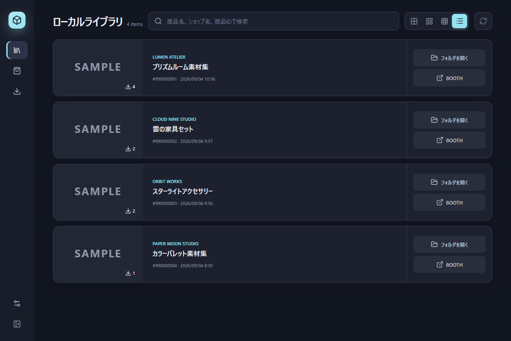

# Booth Shelf

BOOTHから正当にダウンロードできる商品ファイルを、分かりやすいフォルダ構成と独立したローカルデータベースで管理するWindows向けデスクトップアプリです。Rust、Tauri 2、Reactで実装しています。



> [!IMPORTANT]
> Booth Shelfは個人が開発する非公式・実験的なオープンソースソフトウェアです。ピクシブ株式会社、BOOTH、pixiv、BOOTH Library Manager、各ショップオーナーとは提携・承認・協賛関係にありません。本アプリに関する問い合わせを公式サポートやショップオーナーへ送らないでください。

## 主な機能

- アプリ内の権限分離された専用WebViewでBOOTHと購入済みライブラリを表示
- BOOTH・pixivの現在URLを常時表示し、アドレス欄のクリックでコピー
- BOOTHライブラリの通常の「ダウンロード」操作を利用した整理済みダウンロード
- `ショップ/商品名 [booth-ID]/variation-ID` 形式で保存
- 商品名、ショップ名、商品IDによるローカル検索
- 大・標準・小のサムネイル表示と横長リスト表示
- SHA-256、ファイルサイズ、ローカルパスをアプリ専用SQLiteへ記録
- 最大2ファイルの並行ダウンロードと重複ダウンロードの抑止
- ZIPの安全な一時展開、パストラバーサル・リンク・件数・展開サイズ検査
- システム・ライト・ダークテーマとアクセントカラー
- 設定画面にアプリのバージョン、非公式表記、BOOTH・pixiv公式の利用規約とプライバシーポリシーへのリンクを表示

公式BOOTH Library Managerのデータベース、保存先、Windowsの`booth-library-manager://`プロトコル登録は参照・変更しません。

## 動作の概要

1. 専用WebViewでBOOTHへ直接ログインします。認証情報をBooth Shelfのコードへ入力する方式ではありません。
2. 購入済みライブラリの通常の「ダウンロード」が持つ公式URLから、商品とダウンロード対象のIDを検査します。BOOTHがバリエーションIDを付けない通常URLでは、そのダウンロード対象IDを内部の安定キーとして使用します。
3. BOOTHの認証済みWebViewに通常どおりダウンロードさせ、WebView2の保存先だけをアプリ専用の一時領域へ変更します。
4. ダウンロードURLをアプリ側で再取得したり永続化したりせず、完了した一時ファイルを後処理します。
5. ファイルを検査・ハッシュ化し、選択されたライブラリへ移動してローカルSQLiteへ登録します。
6. 商品名とショップ名は、該当する公開商品ページのOpen Graphメタデータから取得します。

詳しい信頼境界とデータフローは[アーキテクチャ](docs/architecture.md)を参照してください。

## 必要環境

- Windows 10またはWindows 11（x64）
- Microsoft Edge WebView2 Runtime
- インストール時およびBOOTH利用時のインターネット接続

## インストール

GitHub Releasesから`Booth Shelf_*_x64-setup.exe`を取得して実行します。

現在のWindowsインストーラにはAuthenticode署名がありません。Microsoft Defender SmartScreenの警告が表示される可能性があります。Windowsの保護機能を無効化せず、配布元がこのリポジトリのGitHub Releasesであることを確認してください。

## 基本的な使い方

1. 設定画面で、Booth Shelf専用の保存先を選択します。公式BOOTH Library Managerの保存先とは分けてください。
2. サイドバーから「BOOTHライブラリ」を開き、BOOTHへログインします。
3. 自分が正当に取得できる商品の「ダウンロード」を選択します。
4. 完了後、ローカルライブラリから商品フォルダを開きます。

## データとプライバシー

- BOOTHのCookieなどの閲覧データは、OSのアプリデータ領域にある専用WebViewプロファイルへ保存されます。設定画面の「BOOTHブラウザーの個人データを削除」から、ダウンロード済みファイルやライブラリ登録を残したまま消去できます。
- SQLiteには、保存先、商品ID・名称・ショップ名、商品URL、サムネイルURL、ファイル名、ローカルパス、SHA-256、サイズ、ダウンロード日時を保存します。
- 注文ID、Cookie、CSRFトークン、署名付きダウンロードURLはSQLiteやアプリログへ保存しない設計です。
- WebView上部のアドレス欄には、現在のBOOTH・pixivのホストとパスを表示します。認証情報を含み得るクエリとフラグメントは表示・コピーせず、BOOTHライブラリの数値ページ番号だけを保持します。アドレス欄は編集や文字選択に対応せず、左クリックで表示中のURLをコピーします。
- テレメトリ、広告、商品ファイルの外部アップロード機能はありません。
- 通常のBOOTH通信に加え、ダウンロード時に公開商品ページとBOOTH画像CDNへアクセスします。
- BOOTH WebViewへ渡すダウンロード通知データは、ランダムな通知IDと状態だけです。ファイル名、商品ID、保存パス、内部エラー文は渡しません。完了通知をクリックした場合は、短時間だけ保持する一度限りの通知IDからRust側で保存フォルダを解決します。

## 重要な制限と安全上の注意

- BOOTHが公開仕様として保証していない日本語版ライブラリのDOM、通常ダウンロードリンクの形式、WebView2のダウンロードイベントに依存しています。サービス側の変更・制限により、予告なく一部または全部が動作しなくなる可能性があります。
- BOOTHライブラリでは「その他のDL方法」を常時隠し、通常の「ダウンロード」だけを表示します。商品IDと公式ダウンロードURLを一意に確認できた場合だけアプリの保存処理へ接続し、ページ構造が想定と異なる場合はダウンロードを安全側に停止します。
- ポップアップは拒否します。認証フローがポップアップ必須へ変更された場合は利用できません。
- ダウンロードした商品とZIP内ファイルは信頼せず、ウイルス対策ソフト等で確認してください。Booth Shelfが展開したファイルを自動実行することはありません。
- 設定画面の一括削除は、Booth ShelfのSQLiteに登録されたファイルと展開フォルダを完全に削除します。ごみ箱には移動せず、元に戻せません。専用の保存先を使用し、確認画面の対象パスを必ず確認してください。
- 既存ファイルを強制的に上書きする更新機能、タグ編集、ZIP以外の自動展開は未実装です。

## 利用者の責任

利用者自身が正当にダウンロードできる商品にのみ使用し、[BOOTH・pixivの利用規約とガイドライン](https://policies.pixiv.net/)、各クリエイターが定める利用条件、適用法令を遵守してください。ダウンロードした商品データの共有、再配布、販売、改変その他の利用可否は、各権利者が定める条件に従います。

## 開発

### 必要なツール

- Node.js 24
- Rust stable（MSVC toolchain）
- Visual Studio Build Toolsの「C++によるデスクトップ開発」
- Microsoft Edge WebView2 Runtime

### セットアップ

```powershell
npm.cmd ci
npm.cmd run tauri -- dev
```

### 検証

```powershell
npm.cmd run test
npm.cmd run build
cargo fmt --manifest-path src-tauri/Cargo.toml --check
cargo clippy --manifest-path src-tauri/Cargo.toml --all-targets --locked -- -D warnings
cargo test --manifest-path src-tauri/Cargo.toml --locked
```

実機確認を含む手順は[開発ドキュメント](docs/development.md)を参照してください。

## リリース

`v1.0.0`のように、`package.json`、`src-tauri/Cargo.toml`、`src-tauri/tauri.conf.json`と一致するタグをpushすると、GitHub Actionsが検証とWindows x64 NSISビルドを実行し、未署名インストーラを含むドラフトReleaseを作成します。内容と生成物を確認してから手動で公開してください。

## ライセンスと商標

このリポジトリで本プロジェクトが権利を有するソースコードは[MIT License](LICENSE)で提供します。

MIT Licenseは、BOOTH・pixivの名称、商標、ロゴ、ウェブサイト上の素材、商品情報、購入・ダウンロードしたコンテンツ、その他第三者の著作物には適用されません。これらの権利は各権利者に帰属します。
